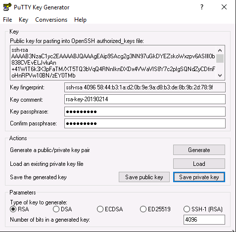
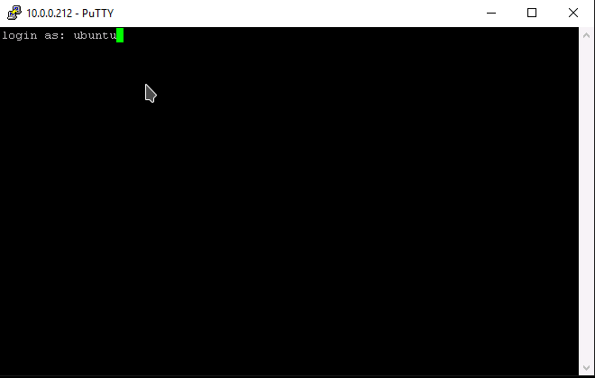
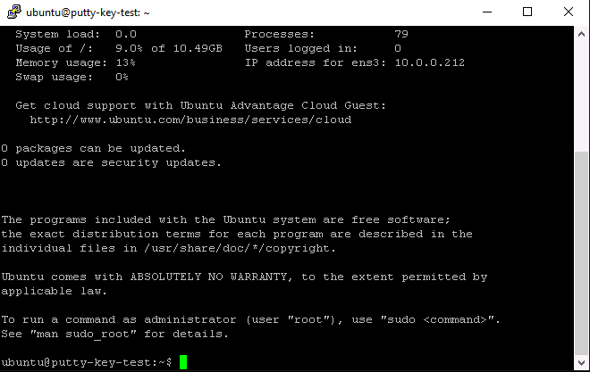

===
FAQ
===

***********************************
How to SSH from Windows using PuTTY
***********************************

This is intended as a quick guide for Windows users on how to create SSH keys
and connect via SSH to Linux instances using PuTTY and PuTTYgen.

What is PuTTY
=============

``PuTTY`` is an open source SSH client, developed originally by Simon Tatham
for the Windows platform.

This guide assumes that you have downloaded and installed the latest **msi**
package which can be found `here`_.

.. _`here`: https://www.chiark.greenend.org.uk/~sgtatham/putty/latest.html

Once the package has been installed you should have access to 2 new
applications, ``PuTTY`` which is the SSH client and ``PuTTygen`` which is the
SSH key management tool.

Creating an SSH key
===================

Launch the PuTTYgen application.

Set the Parameters as follows:

- Type : RSA
- Number of bits in generated key : 4096

Then click Generate

.. image:: _static/images/ssh-with-putty_1.png
   :align: center

Move the mouse around to generate enough entropy to create the key

.. image:: _static/images/ssh-with-putty_2.png
   :align: center

Once the key has been created, set a passphrase and save the private key and
the public key. In this example we will save the private key as **id_rsa.ppk**

Adding your SSH key to your project
===================================

Once you have successfully created your SSH key you need to import the public
portion into your cloud project.

First highlight and copy ALL of the text in the Public key for pasting dialogue
box. Ensure you scroll to the bottom to get everything.

.. image:: _static/images/ssh-with-putty_4.png
   :align: center

Next, log into the cloud dashboard, select **Add Key** from left
hand menu and then enter a meaningful name for the key and
paste in the public key text from the previous step and **Save Key**

Once the key has been imported confirm that the fingerprint matches the one
shown in PuTTYgen.

Connecting with SSH and PuTTY
=============================

Once you have the new key in place in your cloud project you can launch a new
instance providing this as the keypair for authentication. For the purpose of
this example we will assume that the new instance is running Ubuntu.

Open PuTTY and navigate to ``Connection -> SSH -> Auth`` in the Category panel.

Configure the settings as shown below, any existing settings can be left as
they are.

- Allow attempted changes of username in SSH-2 : Checked
- Private key file for authentication : enter the location of the private key
  that was saved in PuTTYgen earlier.

.. image:: _static/images/ssh-with-putty_7.png
   :align: center

In the Category panel switch to the session screen and enter the floating IP
address of the cloud instance you wish to connect to and click Open.

.. image:: _static/images/ssh-with-putty_8.png
   :align: center

In the terminal session that appears enter the default root for the OS that
you have deployed.

You will then be prompted to supply the passphrase that was used when creating
the SSH key in PuTTYgen.

.. Note::

  If this is the first time that you have connected to this server you will also
  be asked to accept the servers host key. Say **Yes** to this.

You should now be logged successfully into your instance.

*****************************
Locale errors on Ubuntu Linux
*****************************

When launching an Ubuntu compute instance using the images provided by
Canonical, we recommend you configure the locale using cloud-init. The
example below illustrates how the locale can be defined at boot time using the
cloud-config syntax.

.. code-block:: bash

  #cloud-config
  fqdn: instancename.example.com
  locale: en_US.UTF-8

If the locale is not configured appropriately, you may get locale related
errors, such as:

* locale.Error: unsupported locale setting
* perl: warning: Setting locale failed
* perl: warning: Please check that your locale settings

These errors can occur while installing packages or performing simple tasks on
the operating system.

If you have not defined the locale at boot time, you can still configure it
later using the following procedure.

First, ensure that your hostname is defined in ``/etc/hosts`` (sudo vi
/etc/hosts). If you only have an entry for localhost, add another entry with
the name of your compute instance, as shown below:

.. code-block:: bash

  127.0.0.1 localhost
  127.0.0.1 instancename

Use the commands below to configure and generate your locales. Replace
``en_US.UTF-8`` with your desired locale.

.. code-block:: bash

  export LC_ALL="en_US.UTF-8"
  sudo echo "LC_ALL=en_US.UTF-8" >> /etc/environment
  sudo dpkg-reconfigure locales

*******************************
Installing Nvidia Drivers
*******************************

Installing the latest 515 drivers for server. More info on the drivers here: https://docs.nvidia.com/datacenter/tesla/tesla-release-notes-515-65-01/index.html

.. code-block:: bash

  apt -y install nvidia-driver-515-server

check by Running

.. code-block:: console

  nvidia-smi
  +-----------------------------------------------------------------------------+
  | NVIDIA-SMI 515.65.01    Driver Version: 515.65.01    CUDA Version: 11.7     |
  |-------------------------------+----------------------+----------------------+
  | GPU  Name        Persistence-M| Bus-Id        Disp.A | Volatile Uncorr. ECC |
  | Fan  Temp  Perf  Pwr:Usage/Cap|         Memory-Usage | GPU-Util  Compute M. |
  |                               |                      |               MIG M. |
  |===============================+======================+======================|
  |   0  NVIDIA RTX A4000    Off  | 00000000:00:05.0 Off |                  Off |
  | 30%   52C    P0    36W / 140W |      0MiB / 16376MiB |      5%      Default |
  |                               |                      |                  N/A |
  +-------------------------------+----------------------+----------------------+

*******************************
Installing Nvidia Cuda drivers
*******************************

Installing the Cuda drivers:

.. code-block:: bash

  apt -y install nvidia-cuda-toolkit

check by Running

.. code-block:: console

  nvcc --version
  nvcc: NVIDIA (R) Cuda compiler driver
  Copyright (c) 2005-2017 NVIDIA Corporation
  Built on Fri_Nov__3_21:07:56_CDT_2017
  Cuda compilation tools, release 9.1, V9.1.85

*******************************
Monitoring Nvidia GPU status
*******************************

You can view the Status of the GPU´s with the following command:

.. code-block:: bash

 watch -n 1 nvidia-smi --query-gpu=gpu_name,clocks.sm,clocks.mem,temperature.gpu,power.draw,clocks_throttle_reasons.sw_thermal_slowdown --format=csv
 
*******************************
Testing Nvidia NCCL
*******************************

These tests check both the performance and the correctness of NCCL operations.
'https://docs.nvidia.com/deeplearning/sdk/nccl-developer-guide/index.html'

NCCL (pronounced "Nickel") is a stand-alone library of standard communication routines for GPUs, implementing all-reduce, all-gather, reduce, broadcast, reduce-scatter, as well as any send/receive based communication pattern. It has been optimized to achieve high bandwidth on platforms using PCIe, NVLink, NVswitch, as well as networking using InfiniBand Verbs or TCP/IP sockets. NCCL supports an arbitrary number of GPUs installed in a single node or across multiple nodes, and can be used in either single- or multi-process (e.g., MPI) applications.

.. code-block:: console

 wget https://developer.download.nvidia.com/compute/cuda/repos/ubuntu2004/x86_64/cuda-keyring_1.0-1_all.deb
 sudo dpkg -i cuda-keyring_1.0-1_all.deb
 sudo apt-get update
 apt-get -y install libcudnn8 libcudnn8-dev libnccl2 libnccl-dev cuda-toolkit-11-7 cuda-11-7 build-essential devscripts debhelper fakeroot linux-headers-$(uname -r)
 git clone https://github.com/NVIDIA/nccl-tests.git
 cd nccl-tests
 make
 ./build/all_reduce_perf -b 8 -e 128M -f 2 -g 10

More info can be found here: 'https://github.com/nvidia/nccl-tests'